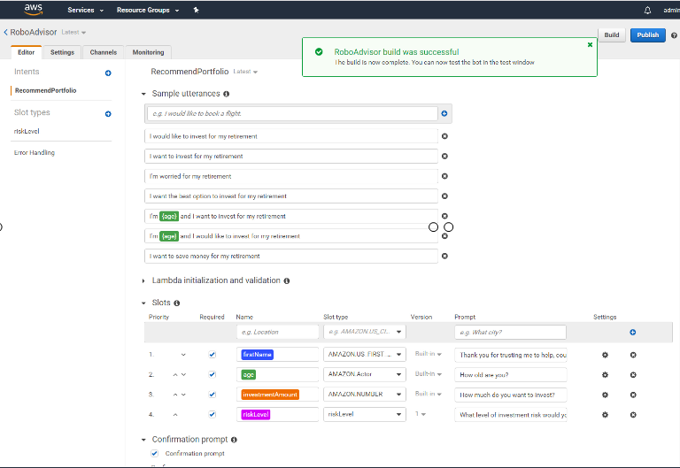
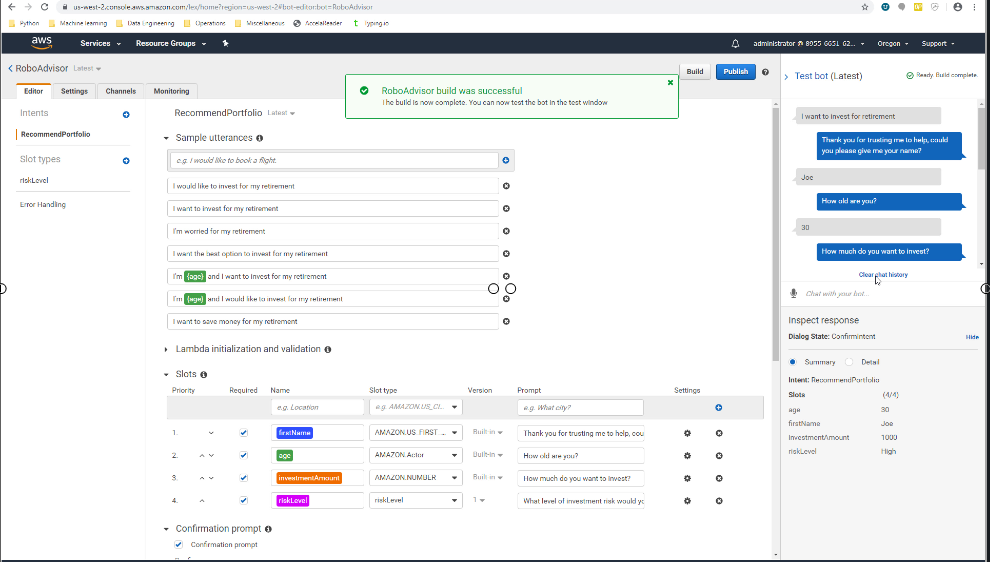
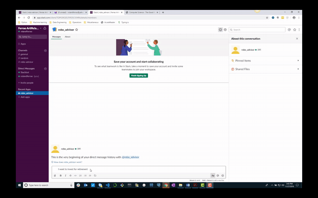
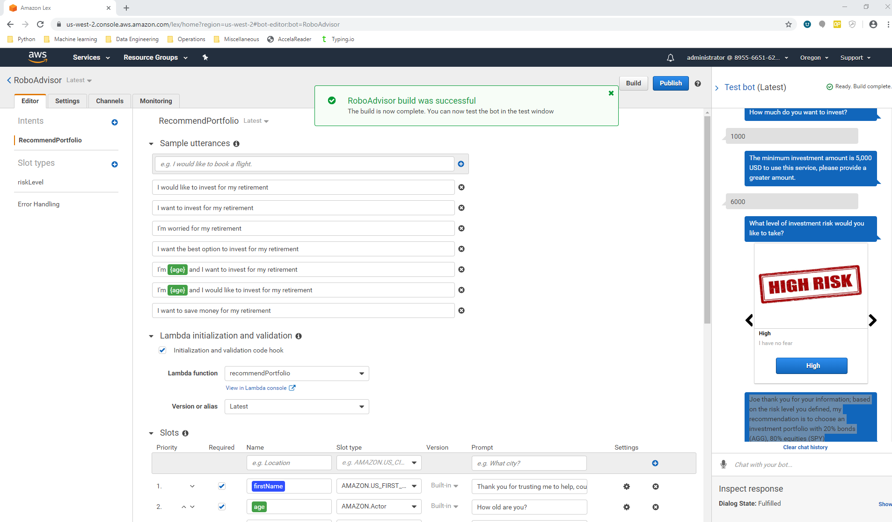
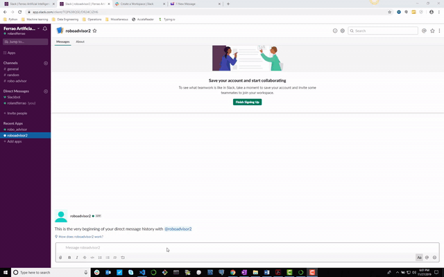

# Robo Advisor

A Robo advisor was created to recommend optimal asset allocations for a retirement portfolio based on age and investment amount as inputs. 

The advisor was then deployed on Slack as an app for users to access. Below are the steps for the process.

1. Robo Advisor Configuration: This entailed setting up bots, slots, and intent modifiers within Amazon Lex on Amazon Web Services. 

2. Test the inital Robo Advisor 1.0: Testing was performed on Amazon Lex within the side navigation panel. This was without any lambda functions. 

3. The inital Robo Advisor 1.0 was then deployed on Slack

4. The Robo Advisor 1.0 was enhanced by adding criteria around age and investment amount which was enabled by a Lambda function to create Robo Advisor 2.0

5. The Robo Advisor 2.0 was then deployed on slack

